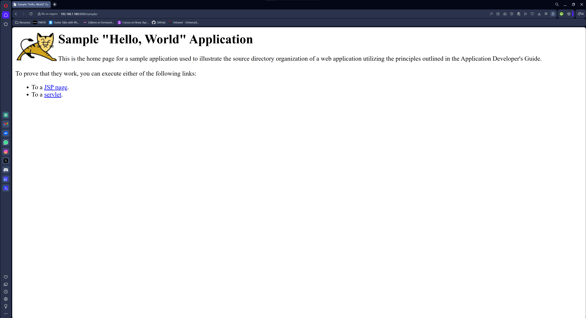
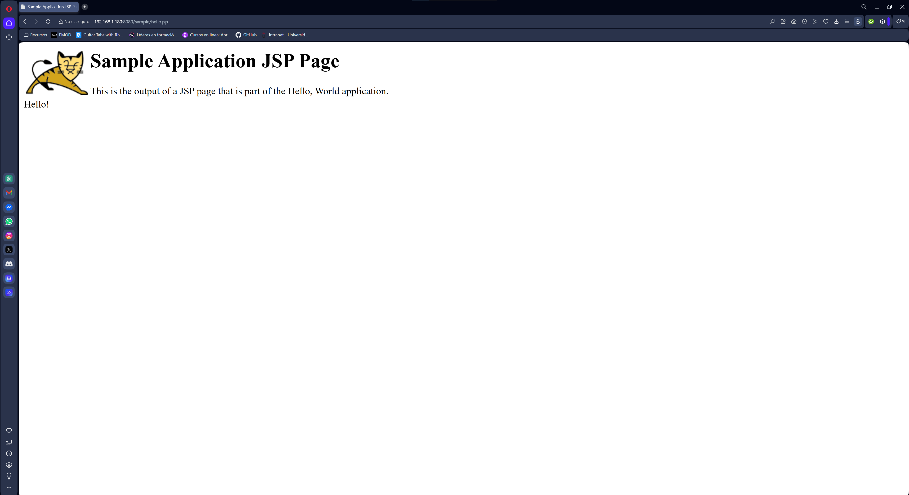
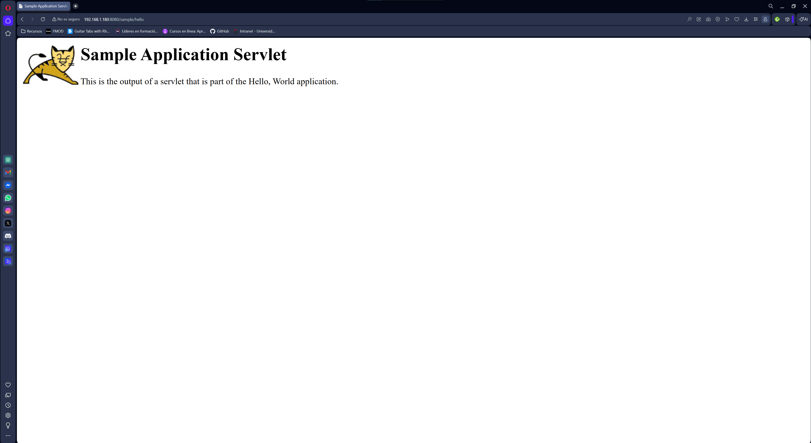

# Apache Tomcat + Nginx Reverse Proxy (Docker)

## Capturas

## Descripción
Despliegue de una aplicación Java (.war) en Apache Tomcat utilizando Nginx como reverse proxy mediante contenedores Docker conectados en una red Docker.

Arquitectura:
Cliente → Nginx → Tomcat → sample.war

---

## Ejecutar con Docker Compose
docker-compose up -d

Parar contenedores:
docker-compose down

---

## Ejecutar manualmente (sin compose)

Crear red:
docker network create red_tomcat

Tomcat:
docker run -d --name aplicacionjava \
  --network red_tomcat \
  -p 8080:8080 \
  -v $(pwd)/sample.war:/usr/local/tomcat/webapps/sample.war:ro \
  tomcat:9.0

Nginx:
docker run -d --name proxy \
  -p 8084:80 \
  --network red_tomcat \
  -v $(pwd)/default.conf:/etc/nginx/conf.d/default.conf:ro \
  nginx

---

## Acceso
Tomcat:
http://localhost:8080/sample

Nginx:
http://localhost:8084

---

## Configuración Nginx
default.conf
server {
    listen 80;
    server_name localhost;

    location / {
        proxy_pass http://aplicacionjava:8080/sample/;
    }
}

## Tecnologías
Docker  
Docker Compose  
Apache Tomcat  
Nginx  
Reverse Proxy