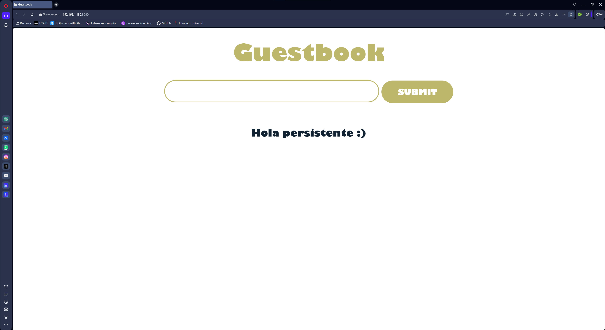
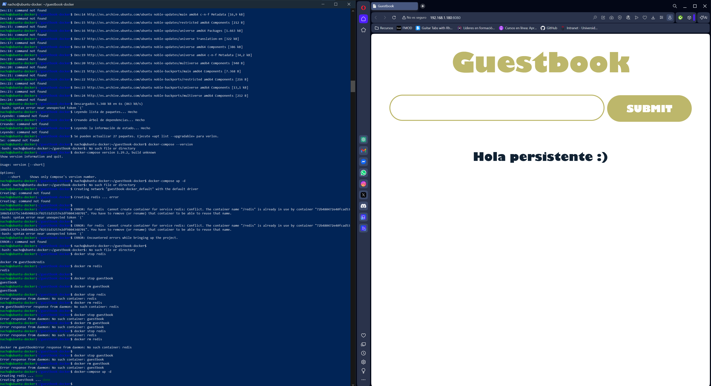

# Guestbook Docker (Flask + Redis)

Proyecto Docker usando Docker Compose con Flask y Redis.

---

## Arquitectura
Flask -> Redis -> Volumen persistente

---

## Servicios
- Flask Guestbook
- Redis
- Volumen persistente
- Red Docker

---

## Docker Compose
docker-compose up -d

docker-compose down

docker ps

---

## Acceso
http://localhost:8080

---

## Tecnologías
- Docker
- Docker Compose
- Flask
- Redis
- Volumes
- Networks