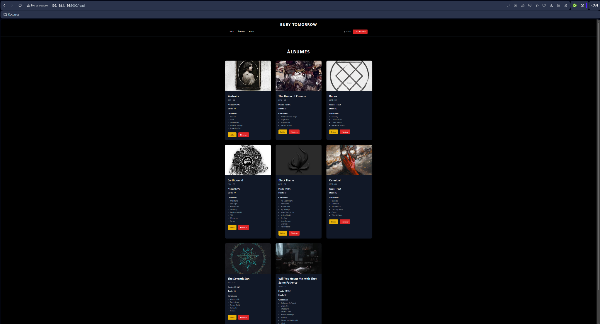
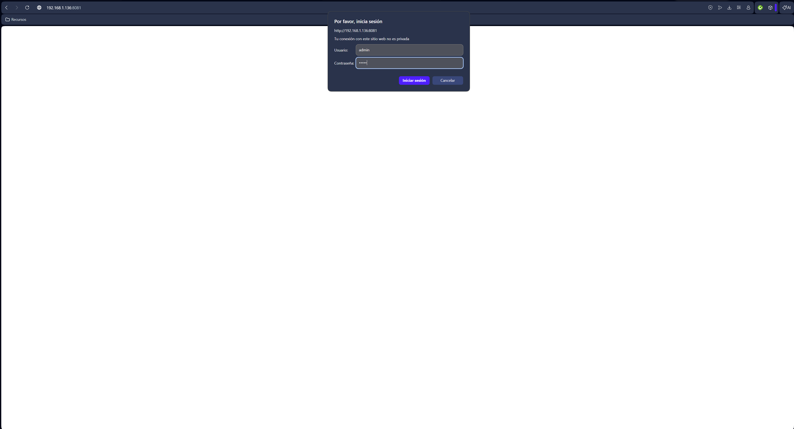
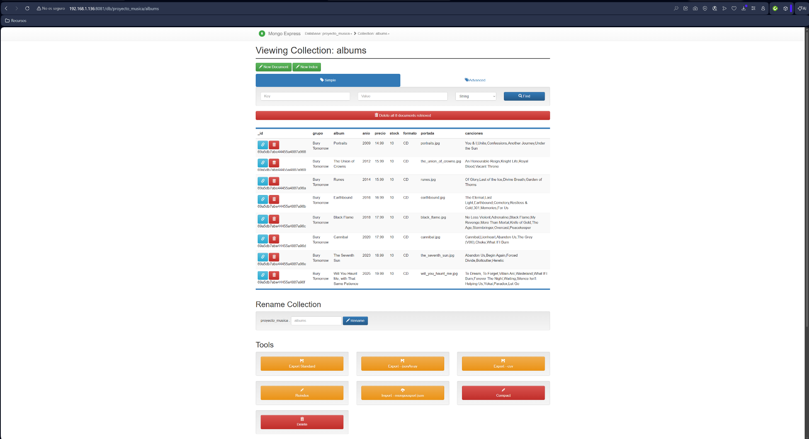
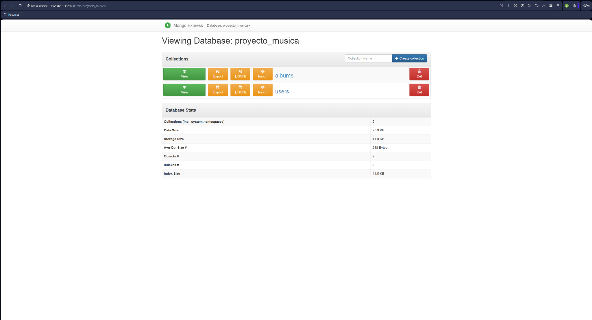
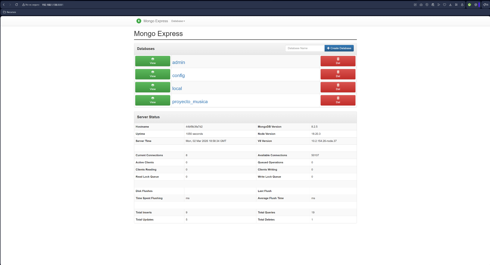
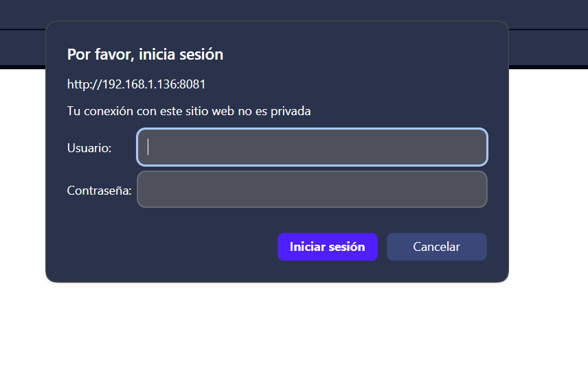
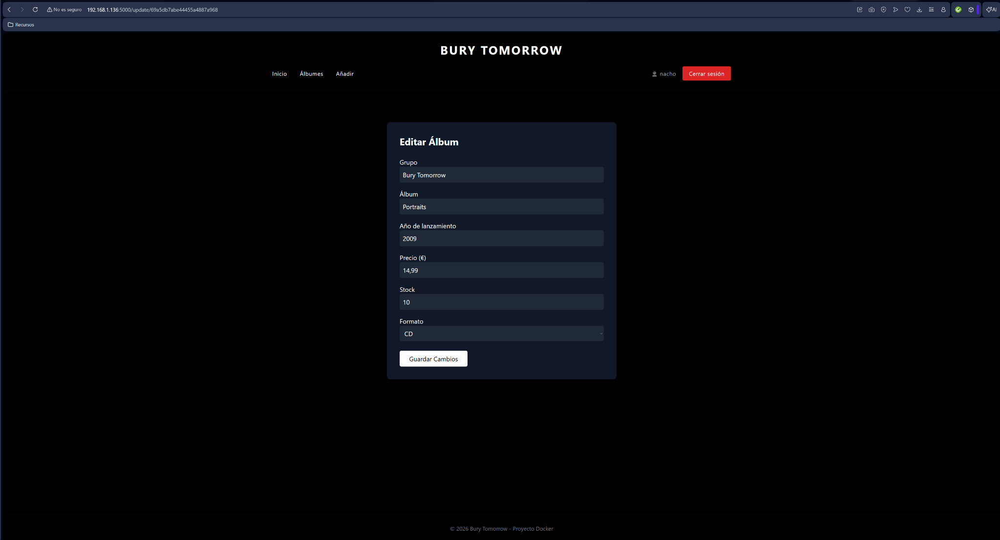
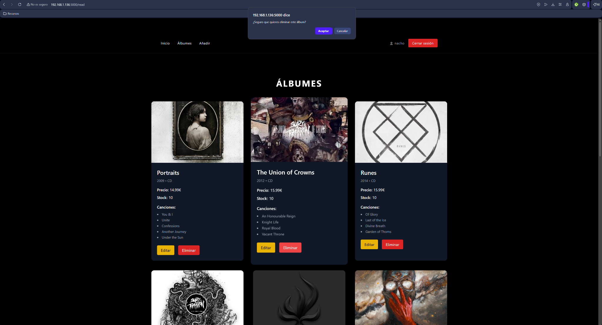
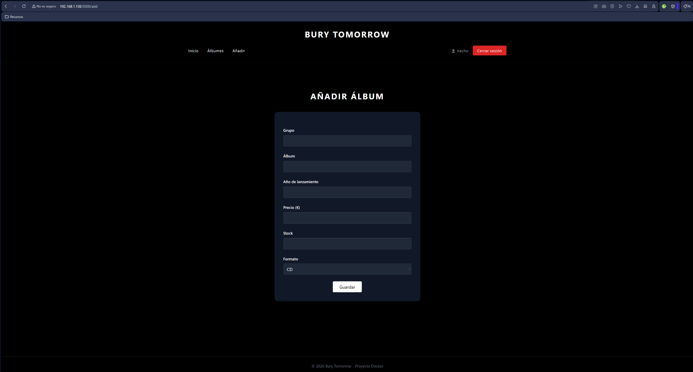

# 🎵 Proyecto Música – Flask + Docker + MongoDB



## 📌 Descripción

Aplicación web desarrollada con **Flask** que permite la gestión de álbumes musicales.  
Incluye sistema de autenticación (registro y login), conexión a base de datos MongoDB y despliegue mediante contenedores Docker.

El proyecto está completamente dockerizado para garantizar portabilidad, escalabilidad y facilidad de despliegue en cualquier entorno.

---

## 🚀 Tecnologías utilizadas

- 🐍 Python 3  
- 🌶 Flask  
- 🍃 MongoDB  
- 🐳 Docker  
- 🐳 Docker Compose  
- 🧩 HTML5  
- 🎨 CSS  
- 🔐 Sistema de autenticación (Login / Register)

---

## 🐳 Imagen en Docker Hub

La imagen del proyecto está disponible en Docker Hub:

👉 https://hub.docker.com/r/nachoslkndocker/proyectovs2dawflaskmusica

Puede descargarse directamente con:

```bash
docker pull nachoslkndocker/proyectovs2dawflaskmusica
```

---

## 🖼 Capturas del proyecto

### MongoDB + Login






### Login



### Aplicación






---

## 📂 Estructura del proyecto

```
Proyecto_musica/
│
├── app/
├── Dockerfile
├── docker-compose.yml
├── requirements.txt
├── img/
└── README.md
```

---

## 🎯 Objetivos de la práctica

- Integrar backend Flask con MongoDB.  
- Implementar sistema de autenticación completo.  
- Contenerizar la aplicación mediante Docker y Docker Compose.  
- Publicar imagen en Docker Hub.  
- Organizar el proyecto siguiendo una estructura profesional lista para despliegue.

---

## 👨‍💻 Autor

Práctica realizada por Nacho.

