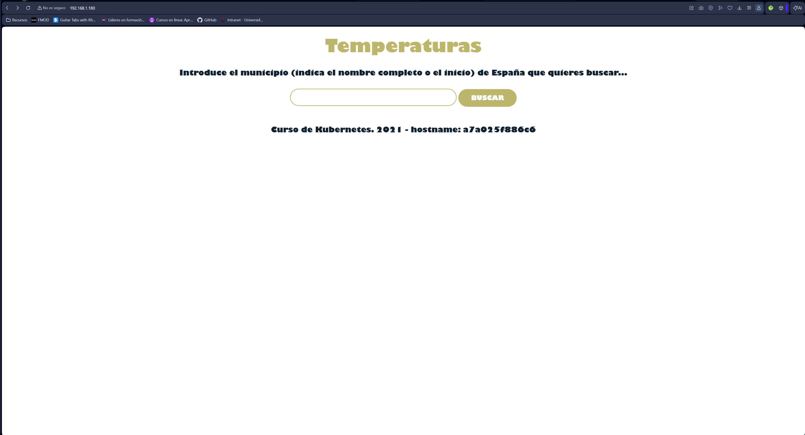
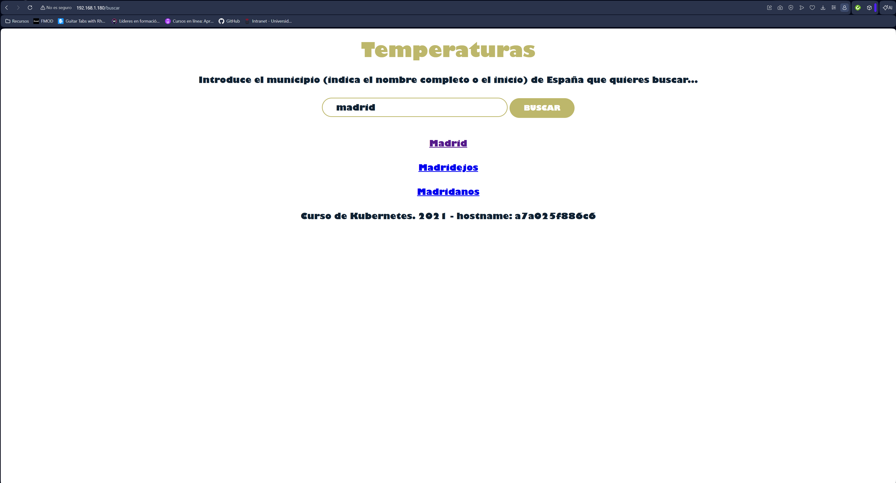
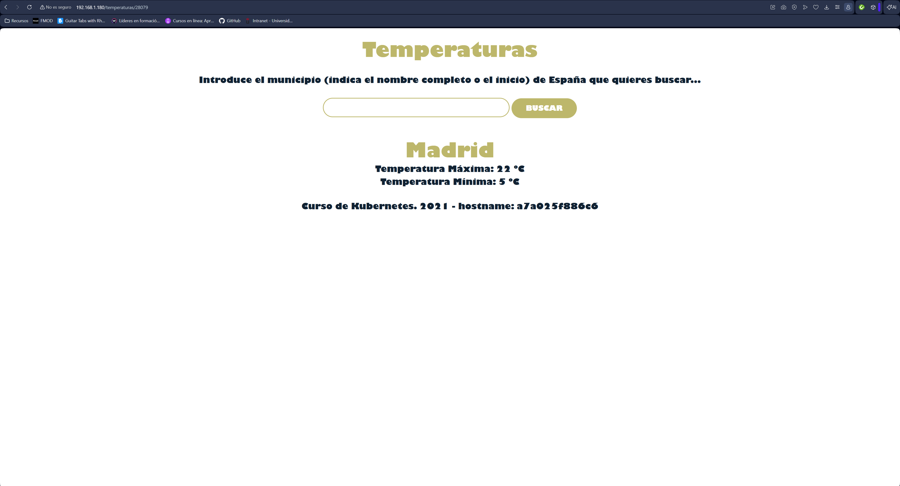

# Temperaturas Docker (Frontend + Backend)

Proyecto Docker usando Docker Compose con frontend y backend de temperaturas.

## Servicios
- Frontend Temperaturas
- Backend Temperaturas
- Red Docker

## Ejecutar
docker-compose up -d

## Parar
docker-compose down

## Ver contenedores
docker ps

## Acceso
http://localhost:8081

## Arquitectura
Frontend -> Backend

