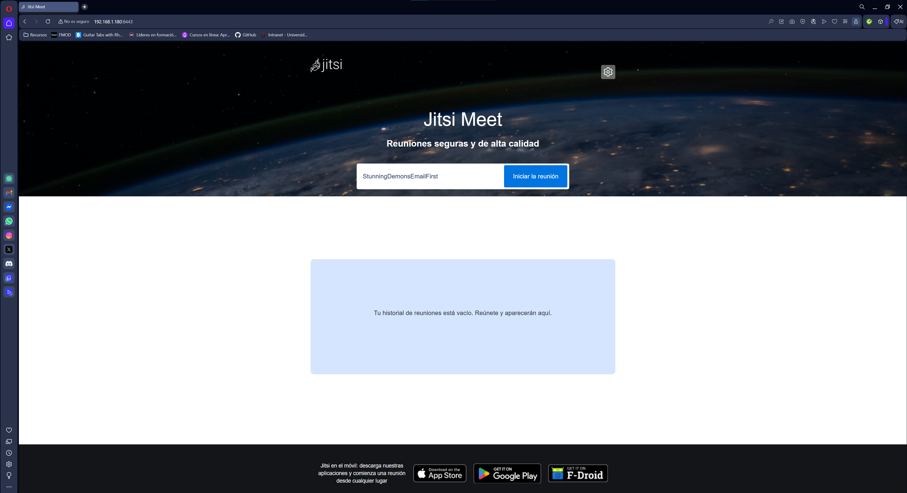
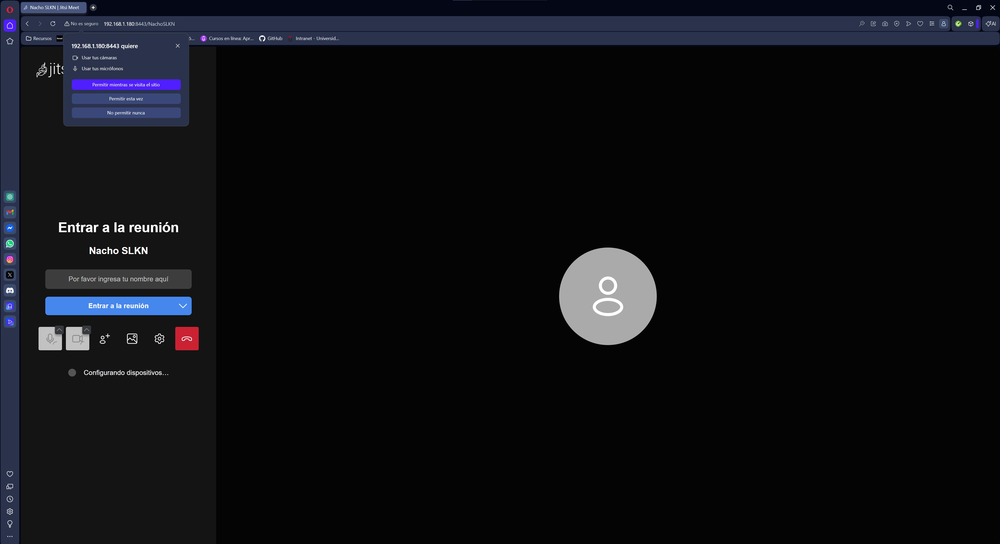
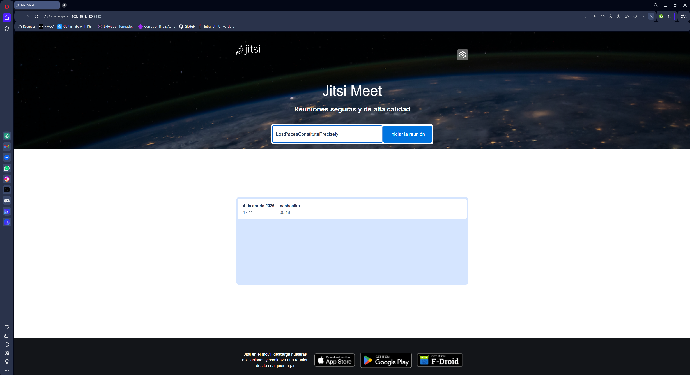

# Jitsi Meet on Docker

Despliegue de Jitsi Meet utilizando Docker Compose en Ubuntu Server.

## Servicios Docker
Este despliegue incluye los siguientes contenedores:
- web
- prosody
- jicofo
- jvb

## Configuración
Se ha modificado el archivo `.env` para configurar la IP del servidor:

PUBLIC_URL=https://192.168.1.180:8443

## Despliegue
Pasos realizados:

1. Copiar archivo de entorno
   cp env.example .env

2. Generar contraseñas
   ./gen-passwords.sh

3. Crear directorios de configuración
   mkdir -p ~/.jitsi-meet-cfg/{web,transcripts,prosody/config,prosody/prosody-plugins-custom,jicofo,jvb,jigasi,jibri}

4. Levantar los contenedores
   docker-compose up -d

## Acceso
https://192.168.1.180:8443

[Jitsi](https://jitsi.org/) is a set of Open Source projects that allows you to easily build and deploy secure videoconferencing solutions.

[Jitsi Meet](https://jitsi.org/jitsi-meet/) is a fully encrypted, 100% Open Source video conferencing solution that you can use all day, every day, for free — with no account needed.

This repository contains the necessary tools to run a Jitsi Meet stack on [Docker](https://www.docker.com) using [Docker Compose](https://docs.docker.com/compose/).

All our images are published on [DockerHub](https://hub.docker.com/u/jitsi/).

## Supported architectures

Starting with `stable-7439` the published images are available for `amd64` and `arm64`.

## Tags

These are the currently published tags for all our images:

Tag | Description
-- | --
`stable` | Points to the latest stable release
`stable-NNNN-X` | A stable release
`unstable` | Points to the latest unstable release
`unstable-YYYY-MM-DD` | Daily unstable release
`latest` | Deprecated, no longer updated (will be removed)

## Installation

The installation manual is available [here](https://jitsi.github.io/handbook/docs/devops-guide/devops-guide-docker).

### Kubernetes

If you plan to install the jitsi-meet stack on a Kubernetes cluster you can find tools and tutorials in the project [Jitsi on Kubernetes](https://github.com/jitsi-contrib/jitsi-kubernetes).

## TODO

* Builtin TURN server.
