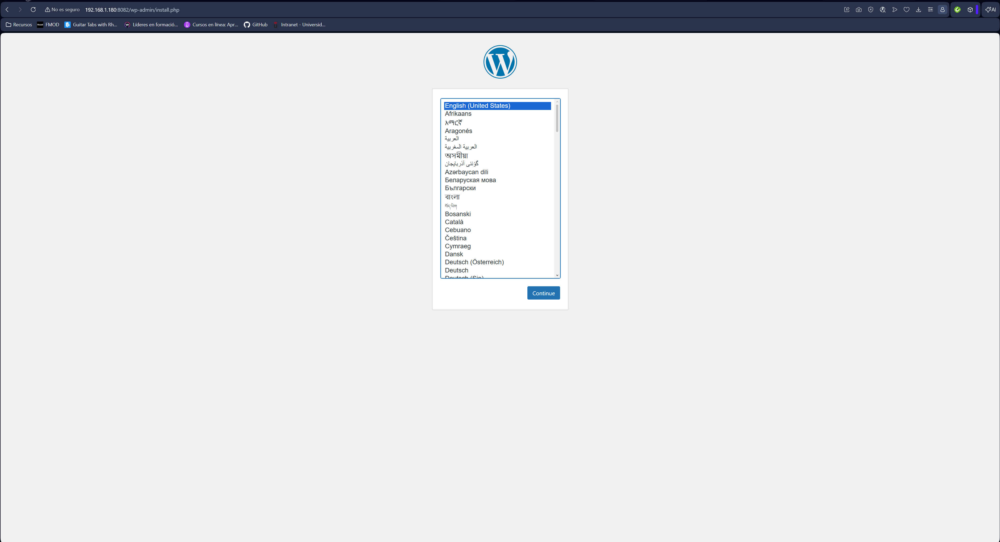
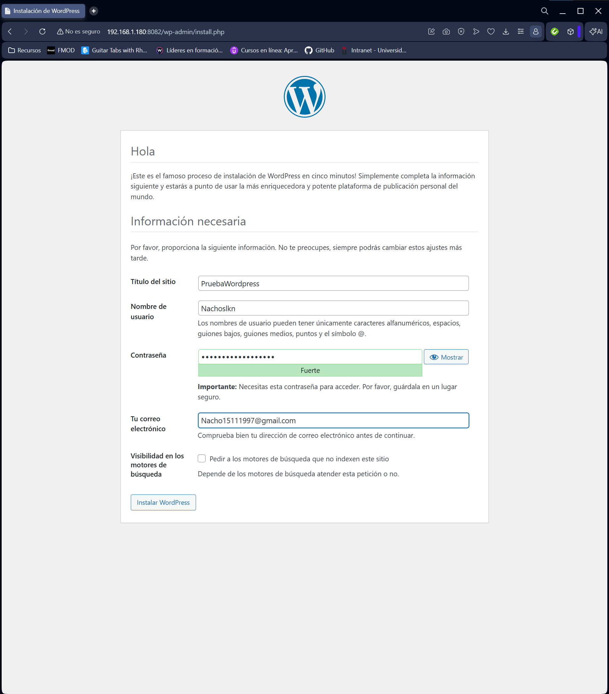
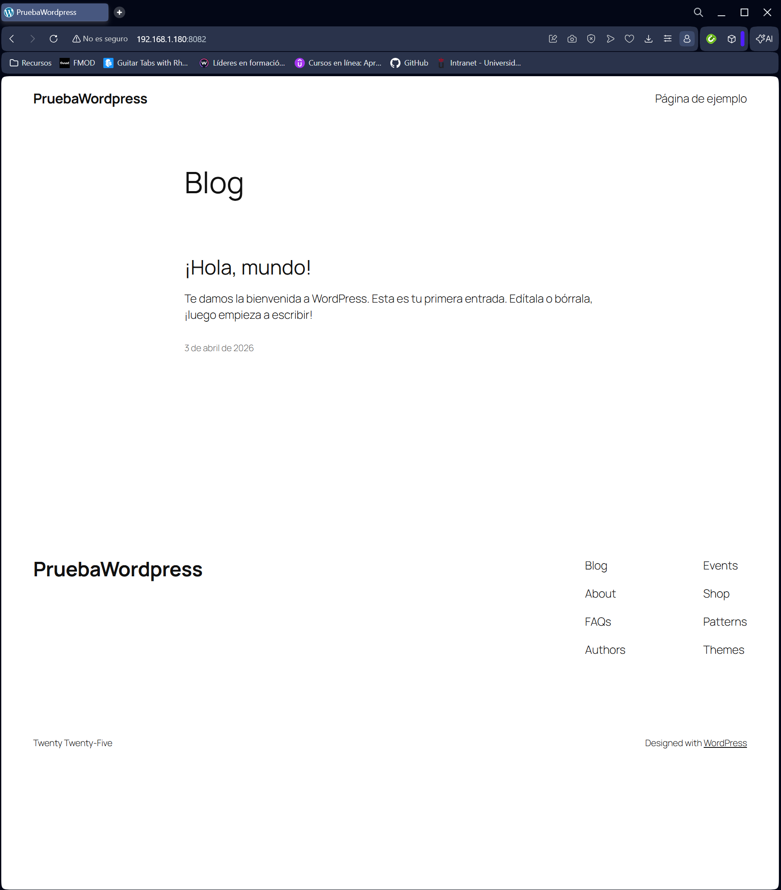

# Wordpress Docker (Wordpress + MariaDB)

Proyecto Docker usando Docker Compose con Wordpress y MariaDB.

## Screenshots

## Servicios
- Wordpress
- MariaDB
- Volúmenes persistentes
- Red Docker

## Ejecutar
docker-compose up -d

## Parar
docker-compose down

## Ver contenedores
docker ps

## Acceso
http://localhost:8082

## Arquitectura
Wordpress -> MariaDB -> Volumen persistente

