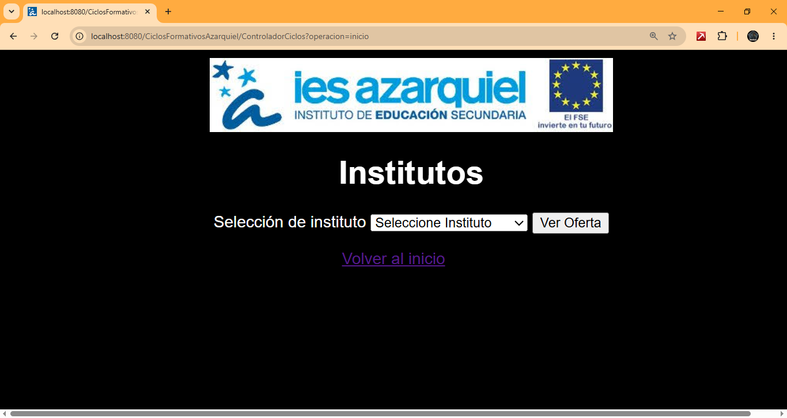
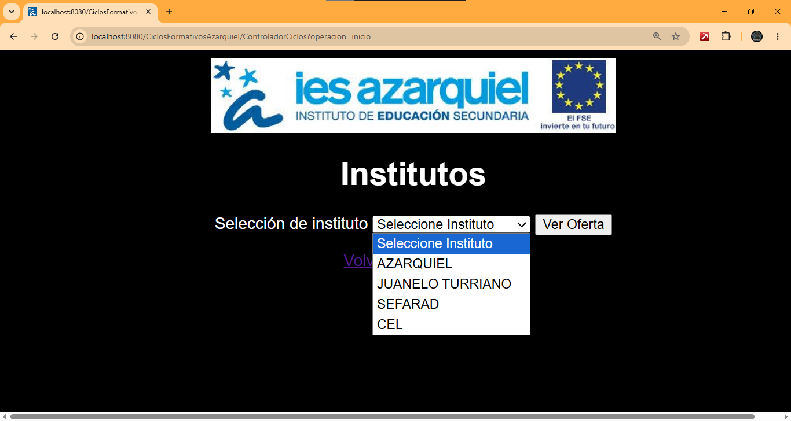
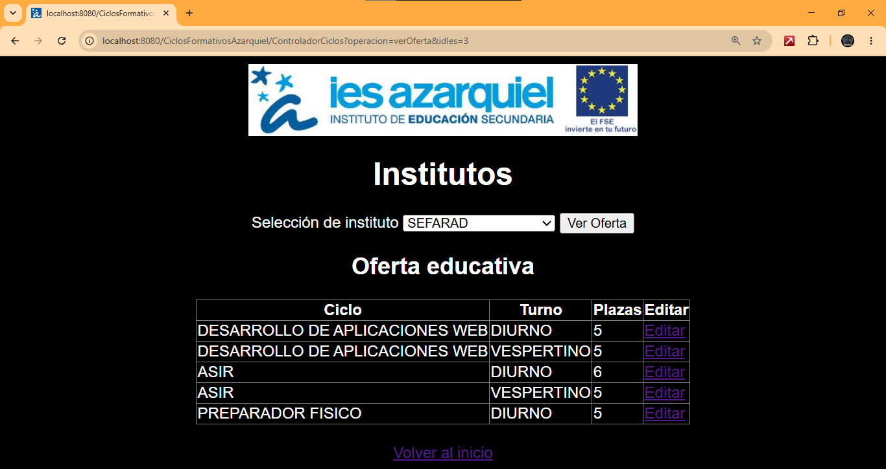
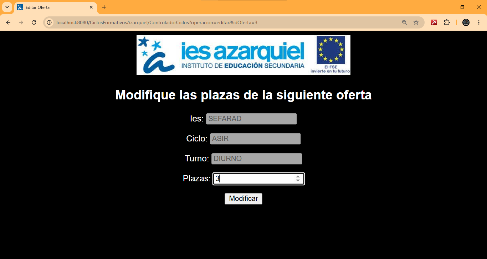
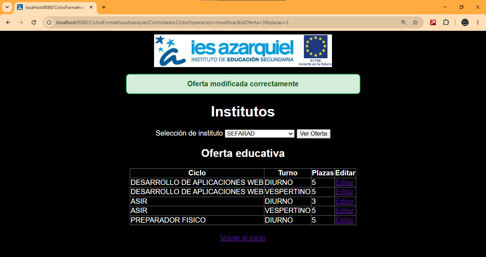

# CiclosFormativosAzarquiel

Aplicación web desarrollada utilizando el patrón Modelo-Vista-Controlador (MVC).

## Tecnologías utilizadas

* Java
* Jakarta Servlet
* JSP
* JPA (EclipseLink)
* MySQL
* Payara Server
* HTML/CSS

## Funcionalidades

* Selección de instituto mediante desplegable.
* Consulta de la oferta educativa de cada instituto.
* Visualización de:

  * Ciclo formativo.
  * Turno.
  * Número de plazas ofertadas.
* Modificación de plazas ofertadas.
* Persistencia de cambios en base de datos.
* Mensajes de confirmación.

## Arquitectura

Vista:

* JSP

Controlador:

* Servlet (ControladorCiclos)

Lógica de negocio:

* ServicioIes

Acceso a datos:

* DaoIes

Persistencia:

* JPA + MySQL

## Capturas

### Pantalla principal

### Selección de instituto

### Oferta educativa

### Formulario de edición

### Confirmación de modificación

## Autor

Ignacio Liñán Vicente
2º DAW - IES Azarquiel
