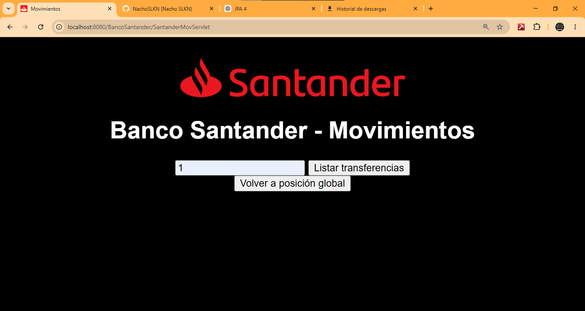
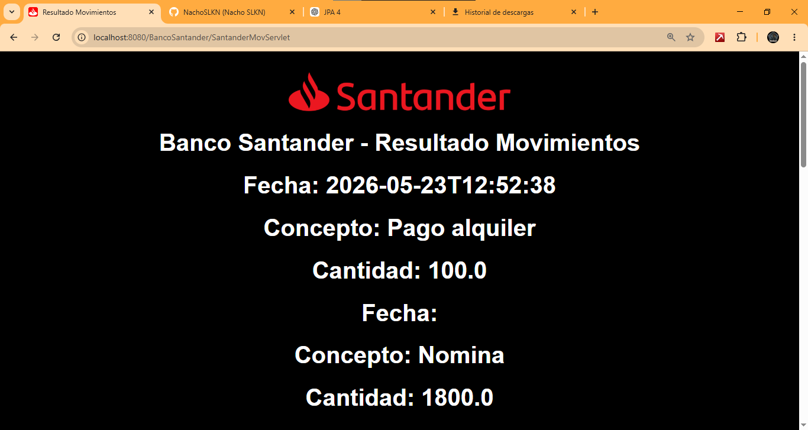
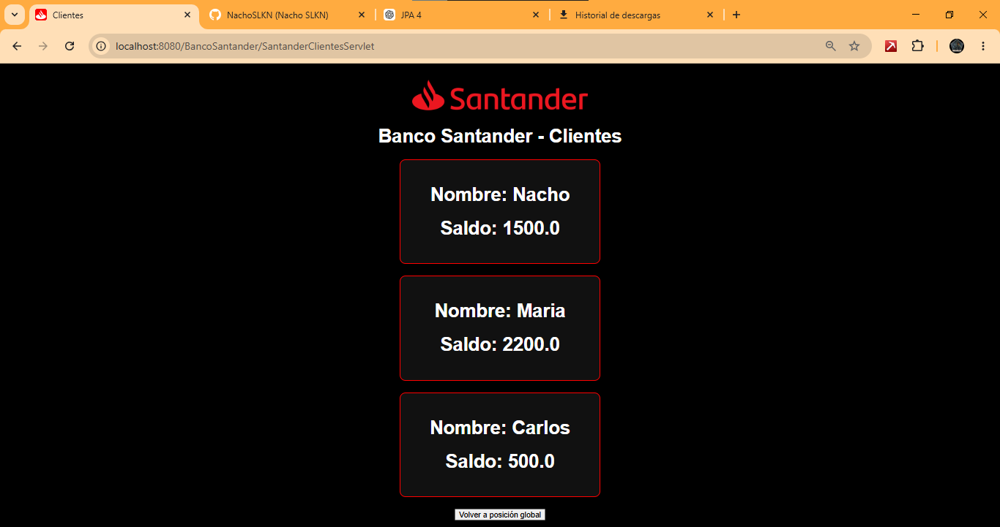
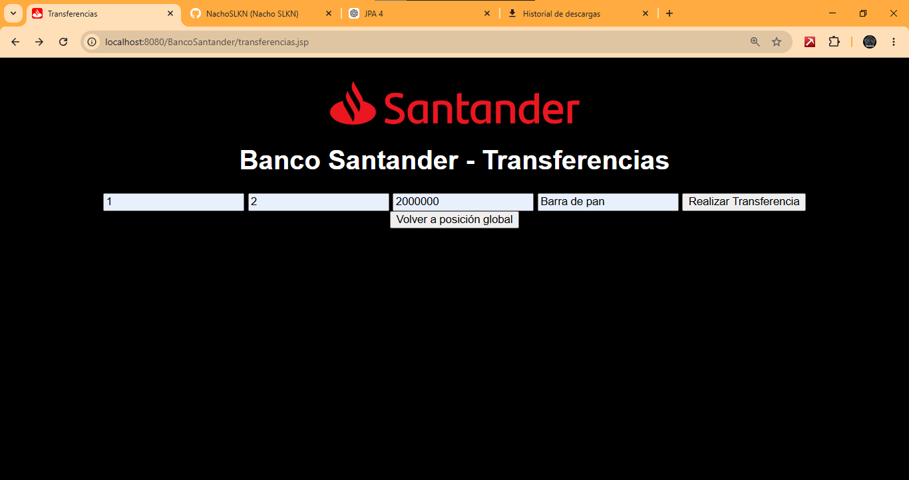
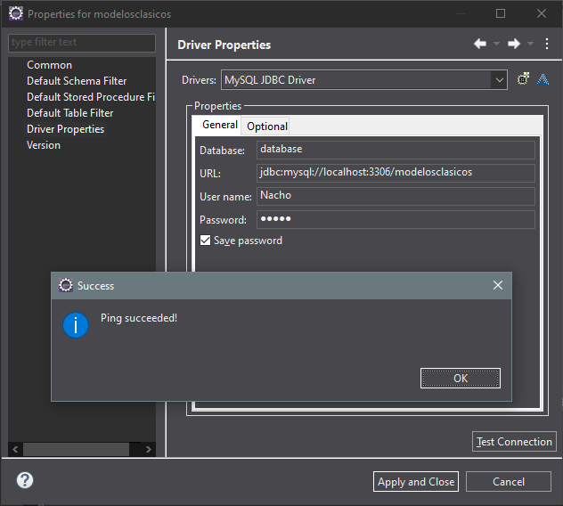
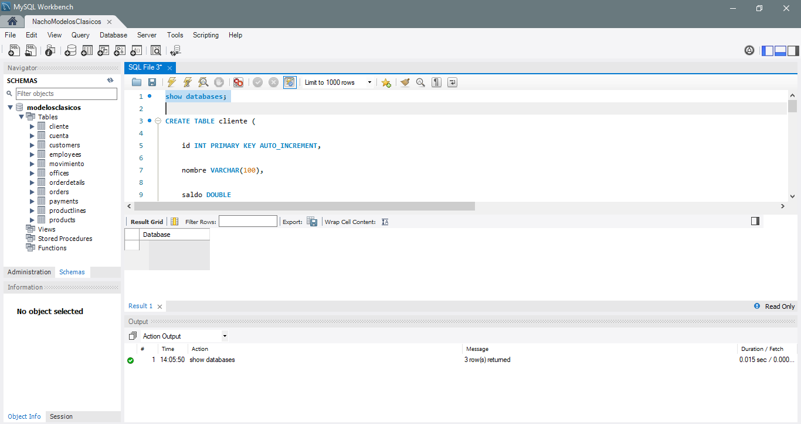
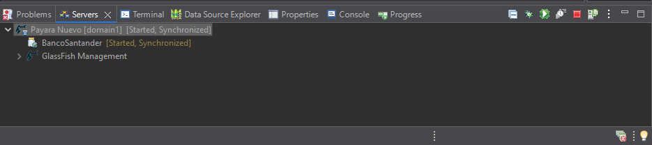

# Banco Santander - JPA MVC Banking App 💳


Mini aplicación bancaria desarrollada con Java Enterprise utilizando:

- Java
- Servlets
- JSP
- JSTL
- JPA (EclipseLink)
- MySQL
- Payara Server
- Arquitectura MVC

---

# 📌 Características del proyecto

## ✅ Transferencias bancarias

La aplicación permite realizar transferencias entre cuentas bancarias validando:

- existencia de cuentas
- saldo suficiente
- importes válidos

La lógica de negocio se implementa en la capa de servicio usando JPA y EntityManager.

```java
ServicioBanco servicio = new ServicioBanco();

servicio.realizarTransferencia(
    cuentaDeudora,
    cuentaAcreedora,
    concepto,
    importe);
```

La aplicación controla errores de negocio mediante excepciones personalizadas:

```java
throw new TransferenciaException(
    "Saldo insuficiente");
```

⚠️ Algunas validaciones frontend todavía no están implementadas.  
Por ejemplo, si se envía el formulario vacío pueden producirse errores HTTP derivados del parseo de datos.  
Sin embargo, sí existen errores controlados desde la lógica de negocio como:

- saldo insuficiente
- cuenta inexistente
- validaciones JPA

---

# 📌 Arquitectura MVC

Separación de responsabilidades:

- Modelo → Entidades JPA
- Vista → JSP
- Controlador → Servlets
- Servicio → Lógica de negocio

Uso de:

```java
request.setAttribute(...)
request.getRequestDispatcher(...)
.forward(...)
```

para comunicar Servlets y JSP.

---

# 📌 JSP privadas mediante WEB-INF

Las páginas JSP internas se almacenan dentro de:

```text
WEB-INF/
```

para impedir acceso directo desde navegador.

Solo pueden abrirse mediante Servlets usando:

```java
request.getRequestDispatcher(...)
.forward(...)
```

---

# 📌 JPA y consultas

Uso de:

- EntityManager
- JPQL
- NamedQuery
- persist()
- find()
- createQuery()
- createNamedQuery()

Ejemplo de NamedQuery:

```java
@NamedQuery(
    name="Cliente.findAll",
    query="SELECT c FROM Cliente c")
```

---

# 📌 Base de datos

La aplicación utiliza:

- MySQL
- Payara Server
- EclipseLink (JPA)

Con persistencia configurada mediante:

```xml
<persistence.xml>
```

---

# 📷 Capturas

## Transferencias



---

## Resultado de transferencia



---

## Movimientos bancarios



---

## Clientes



---

## Configuración conexión BBDD



---

## Configuración MySQL



---

## Configuración Payara



---

# 🚀 Tecnologías utilizadas

- Java 17
- Jakarta EE
- JSP + JSTL
- JPA (EclipseLink)
- MySQL
- Payara Server
- Eclipse IDE

---

# 👨‍💻 Autor

Nacho SLKN
