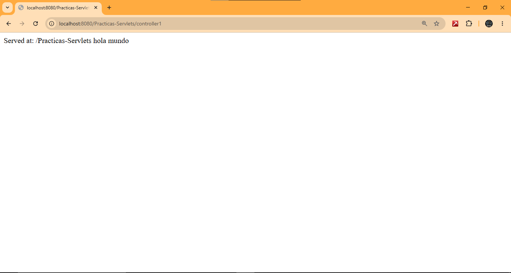
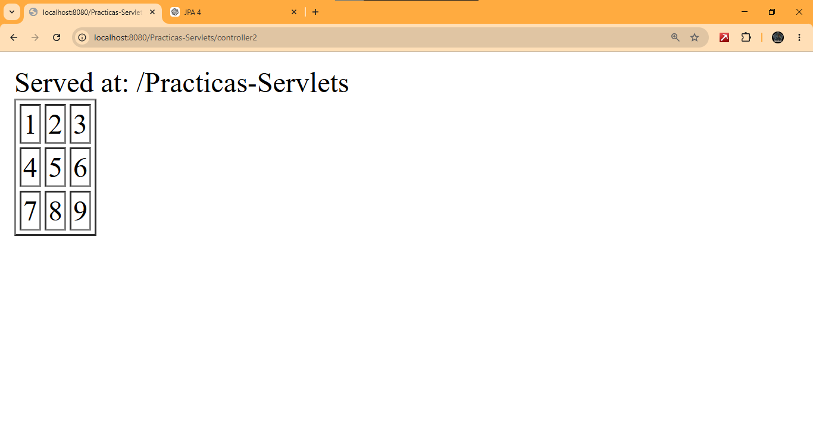
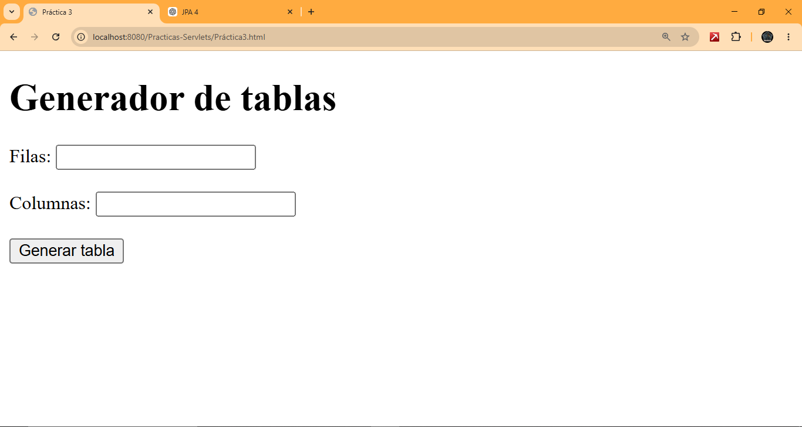
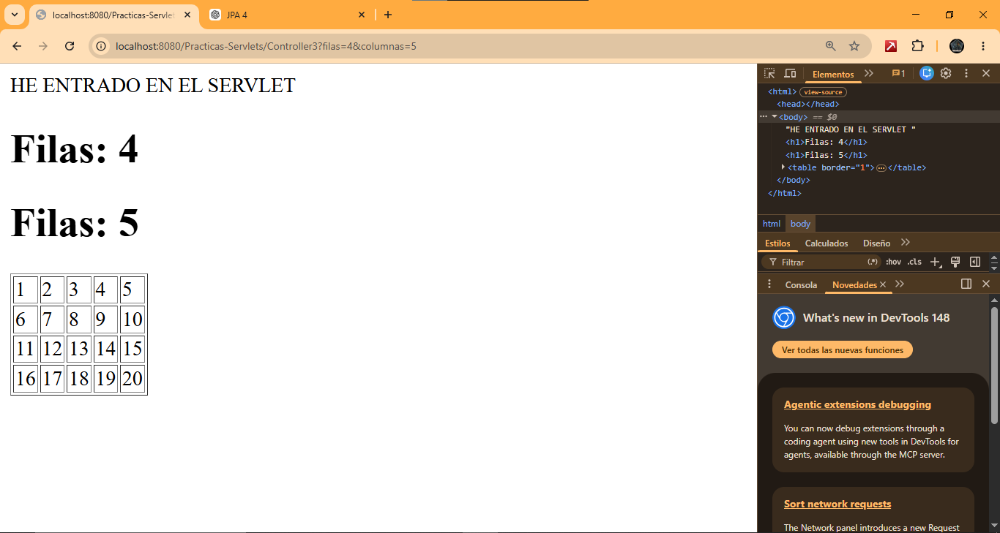
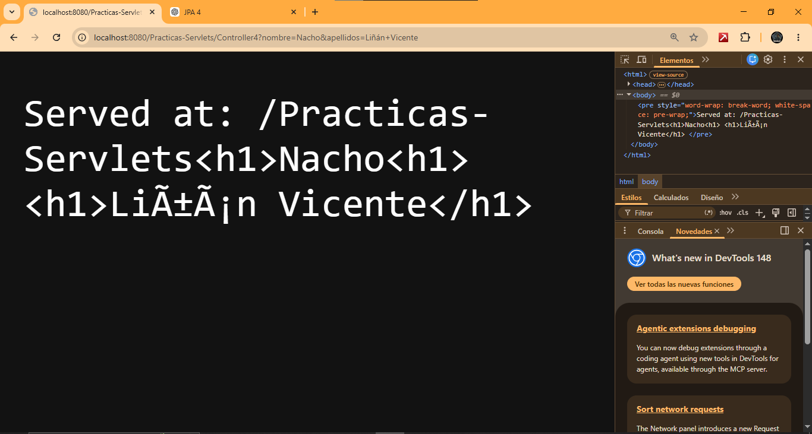
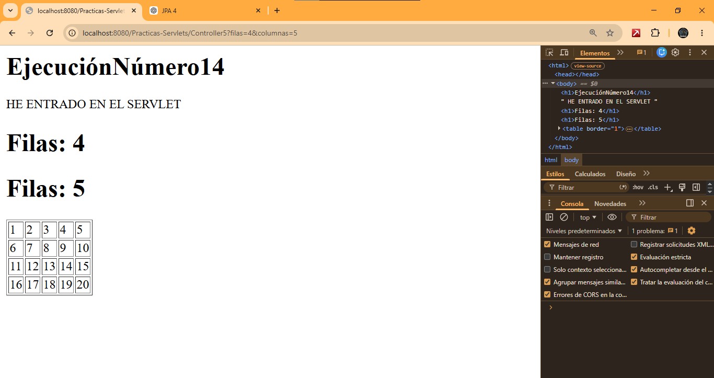

# Prácticas Servlets

Proyecto de prácticas realizado con Jakarta Servlet, Eclipse y Payara Server.

## Tecnologías

- Java
- Jakarta Servlet
- Eclipse IDE
- Payara Server

---

## Práctica 1 - Hola Mundo

Primer servlet mostrando un mensaje simple.

---

## Práctica 2 - Tabla 3x3

Generación de una tabla HTML desde un servlet.

---

## Práctica 3 - Tabla dinámica

Formulario para solicitar filas y columnas y generar una tabla dinámica.

### Formulario

### Resultado

---

## Práctica 4 - Métodos GET y POST

Prueba de envío de formularios utilizando distintos métodos HTTP.

### Formulario

### Resultado

---

## Práctica 5 - Contador de ejecuciones

Servlet que mantiene un contador de accesos.

### Ejecución 1

### Ejecución 2

### Ejecución 3

---

## Práctica 6 - Validaciones

Validación de datos recibidos desde formularios.

---

## Estado

- ✅ Práctica 1 completada
- ✅ Práctica 2 completada
- ✅ Práctica 3 completada
- ✅ Práctica 4 completada
- ✅ Práctica 5 completada
- ✅ Práctica 6 completada
- 🔄 Pendientes: Prácticas 7 a 12