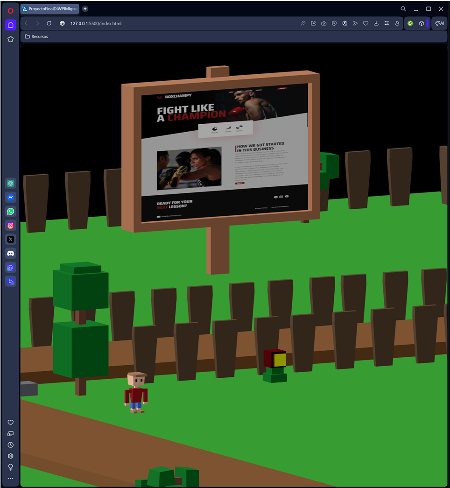
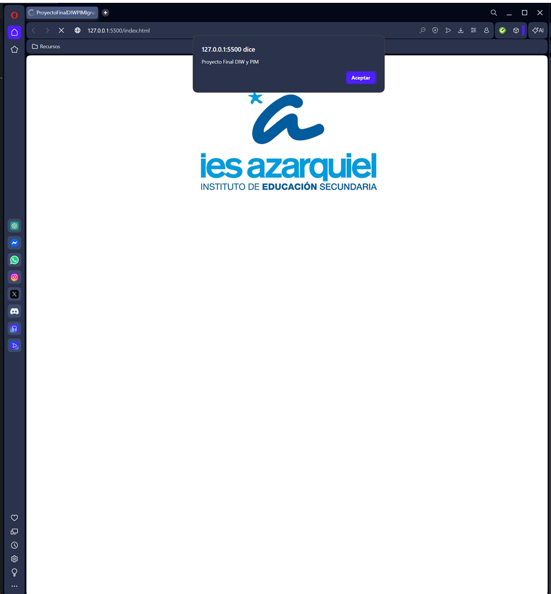
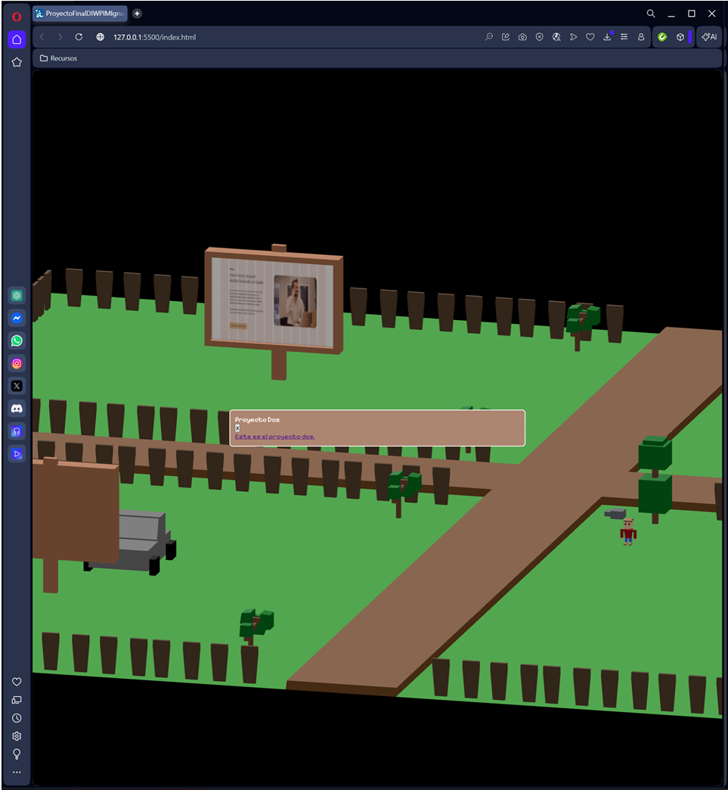
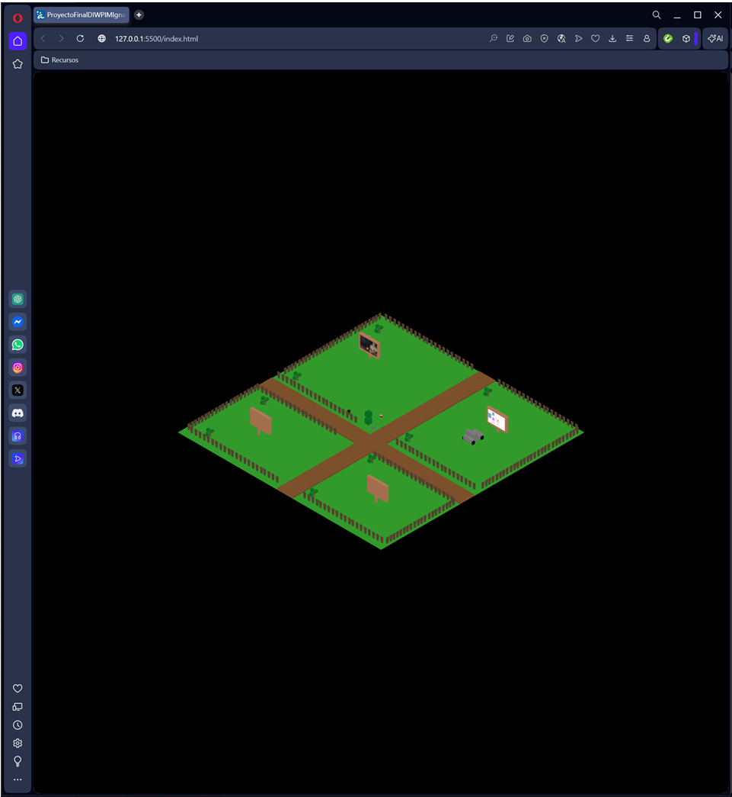
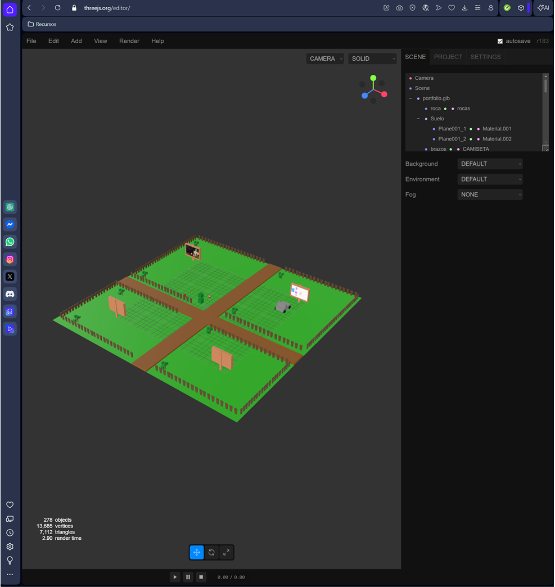

# 🎮 Proyecto Final DIW y PIM  
## Portfoilio interactivo 3D con Three.js (Low Poly)

**Alumno:** Ignacio Liñán  
**Curso:** 2º DAW · IES Azarquiel  
**Fecha:** Febrero 2026  
**En curso.**

---

## 📌 Descripción

Desarrollo de una **portada web interactiva en 3D** utilizando **Three.js**, integrando modelado en **Blender** y exportación en formato **GLB**.

El usuario puede desplazarse por un escenario isométrico estilo *low poly*, interactuar con carteles mediante **raycasting** y abrir un **modal dinámico** con información y enlaces a proyectos.

El objetivo es integrar modelado 3D y desarrollo web en una experiencia interactiva en navegador a modo de portfolio, falta mejorar el entorno así como subir más proyectos cuando pueda, 
y arreglar un pequeño error en el movimiento del jugador. 

---

## 🎯 Objetivos

### Funcionales
- Renderizado 3D en tiempo real sobre `<canvas>`
- Movimiento del personaje (WASD / flechas)
- Detección de objetos interactivos
- Apertura de modales dinámicos

### Técnicos
- Organización jerárquica en Blender
- Exportación correcta a formato GLB
- Carga mediante `GLTFLoader`
- Uso de ES Modules e Import Maps
- Código estructurado en HTML, CSS y JS

---

## 🛠 Tecnologías utilizadas

- **Three.js**
- **Blender**
- **GSAP**
- HTML5
- CSS3
- JavaScript ES Modules

---

## 🗂 Estructura del proyecto
index.html
style.css
main.js
portfolio.glb
portfolio.blend
img/ 

---

## 🎮 Funcionalidades principales

### 🔹 Escena 3D
- Cámara ortográfica (vista isométrica)
- Iluminación ambiental y direccional
- Controles orbitales (modo desarrollo)

### 🔹 Movimiento del personaje
- Control por teclado
- Animación suave con GSAP
- Pequeño salto visual en cada movimiento
- Bloqueo mientras dura la animación (`isMoving`)

### 🔹 Interacción con carteles
- Raycasting con `THREE.Raycaster`
- Detección recursiva de submallas
- Cambio de cursor al detectar interacción
- Modal alimentado desde diccionario JS

---

## 🧠 Problemas resueltos

- Movimiento por partes → solución: nodo contenedor `PLAYER`
- Raycasting en submallas → recuperación de nombre padre
- Reexportación correcta del GLB
- Errores de selectores DOM (`querySelector` null)

---

## 📸 Capturas del proyecto

### Vista general en navegador

### Modal interactivo

### Vista isométrica completa

### Terreno low poly

### Jerarquía en Three.js Editor

---

## 🚀 Mejoras futuras

- Sistema de colisiones
- Límites del mapa
- Cámara de seguimiento dinámico
- Enlaces reales a repositorios y demos
- Optimización de rendimiento

---

## 🔗 Recursos

- https://threejs.org
- https://threejs.org/editor/
- https://cdn.jsdelivr.net/npm/gsap@3.12.5/dist/gsap.min.js

---

Proyecto académico para la asignatura  
**Diseño de Interfaces Web y Programación Multimedia (DIW y PIM)**.

