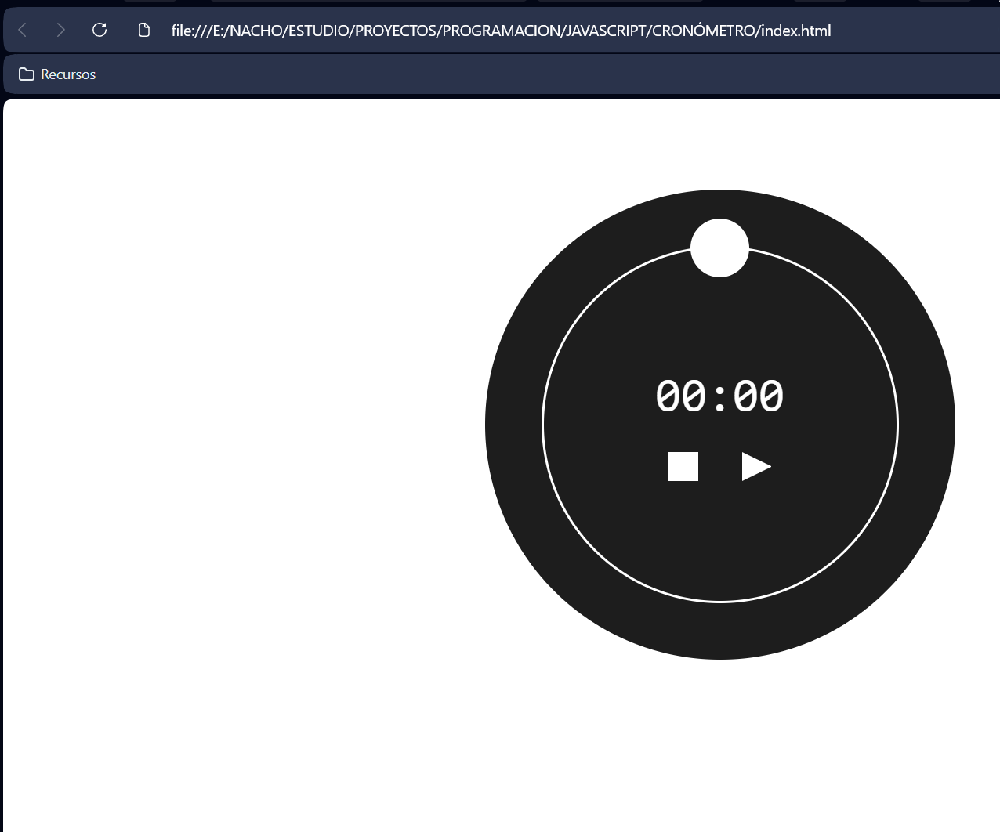

# ⏱️ Cronómetro en JavaScript

Este proyecto es un **cronómetro interactivo desarrollado con HTML, CSS y JavaScript puro**. 

## 🛠️ Tecnologías utilizadas

- HTML5  
- CSS3  
- JavaScript (Vanilla JS)

## 📋 Funcionalidades

- Iniciar el cronómetro
- Pausar el cronómetro
- Reiniciar el tiempo
- Visualización dinámica del tiempo en pantalla
- Interfaz gráfica simple e intuitiva

## 🎓 Origen del proyecto

Este cronómetro ha sido desarrollado siguiendo el mismo tutorial de YouTube que el proyecto **Snake**: https://github.com/NachoSLKN/Desarrollo-Web/tree/main/Frontend/Desarrollo%20Web%20Entorno%20Cliente/Javascript/SNAKE

- `setInterval` y `clearInterval`
- Manejo de estados
- Eventos de usuario
- Actualización dinámica del DOM

📺 **Tutorial:**  
https://www.youtube.com/watch?v=BA328RQa08M

Ambos proyectos se han realizado con el objetivo de afianzar los fundamentos de JavaScript antes de pasar a frameworks como React.

https://github.com/NachoSLKN/Desarrollo-Web/tree/main/Frontend/Desarrollo%20Web%20Entorno%20Cliente/REACTVite

## 🚀 Cómo ejecutar el proyecto

1. Descarga o clona el repositorio
2. Abre el archivo `index.html` en tu navegador
3. Disfruta del cronómetro y que no se te olvide poner la alarma. 

