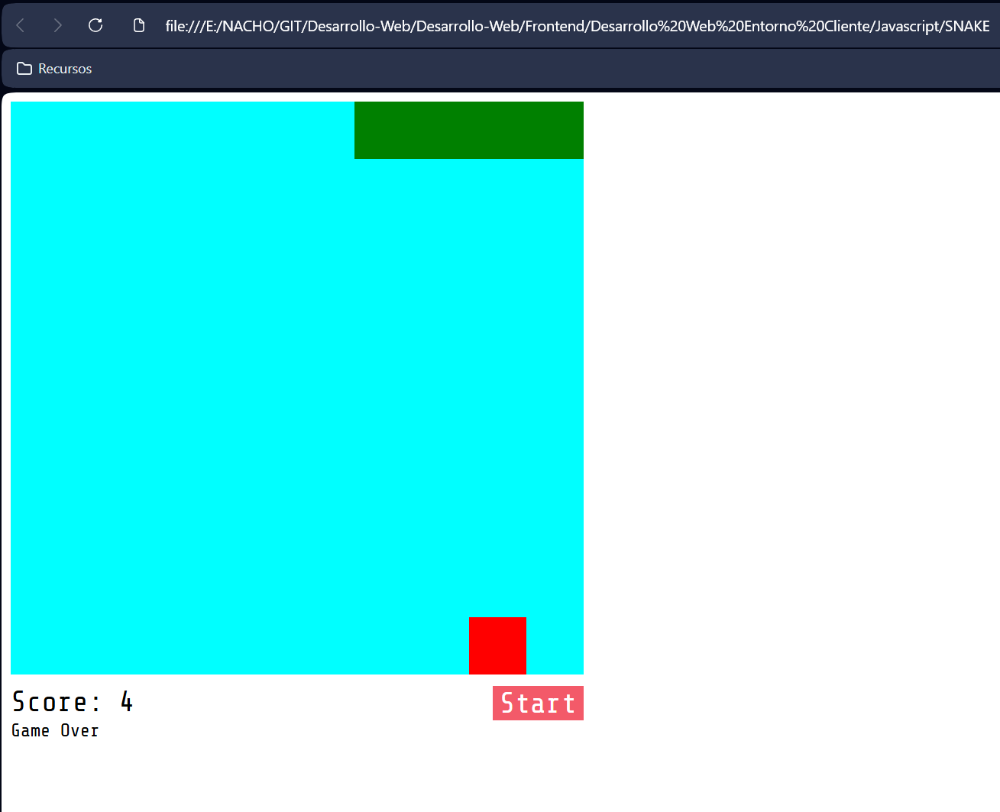

# 🐍 Snake Game (JavaScript)

Juego clásico de **Snake** desarrollado con **HTML, CSS y JavaScript puro**.

Este proyecto forma parte del aprendizaje de **Desarrollo Web en Entorno Cliente**, sin uso de frameworks ni librerías externas.

## 📺 Origen del proyecto

El juego se ha desarrollado siguiendo el siguiente tutorial de YouTube:

👉 https://www.youtube.com/watch?v=BA328RQa08M

El objetivo es comprender la lógica del juego, el manejo del DOM y los eventos de teclado en JavaScript.

## 🚀 Cómo ejecutar el juego

1. Abre el archivo `index.html`
2. Se ejecuta directamente en el navegador
3. Usa las teclas de dirección para mover la serpiente

## 🛠 Tecnologías utilizadas

- HTML5
- CSS3
- JavaScript (Vanilla)

## 📁 Estructura del proyecto

- `index.html` → estructura del juego
- `style.css` → estilos
- `script.js` → lógica del juego
- `screenshots/` → capturas del proyecto

