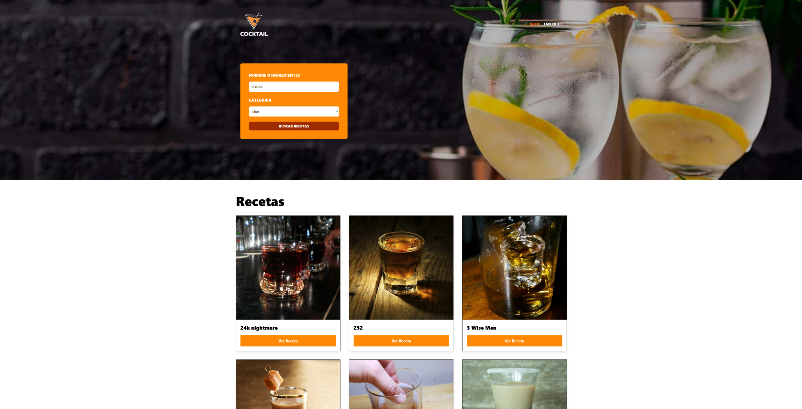

# 🍸 Cocktail — React + TypeScript



Aplicación web para buscar recetas de cócteles mediante una API externa, desarrollada con React y TypeScript.

Permite buscar bebidas por ingrediente y categoría, consultar sus recetas y gestionar una colección de favoritos.

## 🚀 Funcionalidades

- Búsqueda de cócteles por ingrediente.
- Filtrado por categoría.
- Consumo de API externa.
- Visualización dinámica de resultados.
- Consulta de recetas.
- Gestión de favoritos.
- Navegación entre vistas con React Router.
- Validación de datos con Zod.
- Gestión global de estado con Zustand.

## 🛠️ Tecnologías

- React
- TypeScript
- Vite
- React Router
- Zustand
- Zod
- Axios
- Tailwind CSS

## ▶️ Ejecutar el proyecto

```bash
npm install
npm run dev