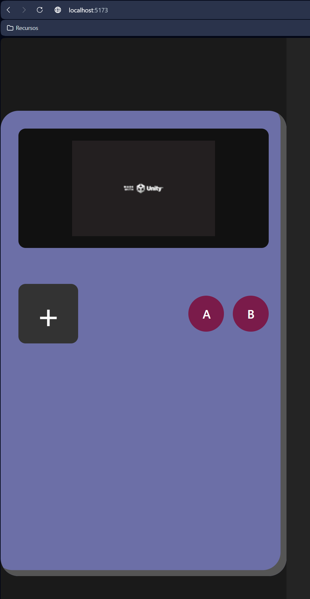
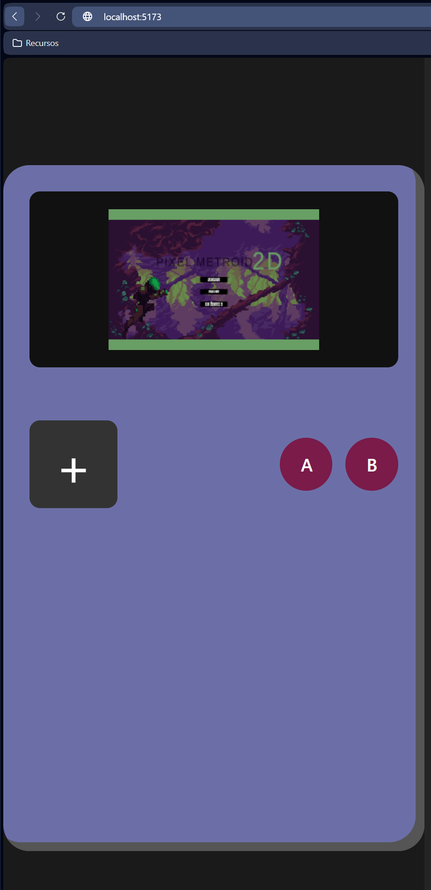

# 🎮 Pixel Metroid – React + Vite (WebGL)

Este proyecto es una **aplicación desarrollada con React + Vite** que actúa como contenedor e interfaz para un **juego WebGL creado íntegramente por mí en Unity**.

Se trata de una **demo funcional**, con mucho margen de mejora, cuyo objetivo principal ya está cumplido:  
👉 **integrar correctamente un juego Unity WebGL dentro de una aplicación React**, sentando las bases para futuros desarrollos.

---

## 🚀 Estado actual del proyecto

- Proyecto **React + Vite**
- Carga correcta de **Unity WebGL**
- Integración funcional entre frontend y juego
- Demo jugable

El proyecto **no está terminado** y queda mucho trabajo por delante, especialmente a nivel de interfaz y experiencia de usuario.

---

## 🎮 Objetivo principal

El objetivo de este proyecto es desarrollar una **interfaz 100% fiel a una Game Boy**, tanto visual como funcionalmente:

- Diseño 1:1 inspirado en la **Game Boy clásica**
- Mapeo completo de **todos los botones** (cruceta, A, B, Start, Select)
- Control total del juego desde la interfaz React
- Comunicación clara entre React ↔ Unity

El juego que se ejecuta dentro de esta interfaz está desarrollado completamente por mí en **Unity**.

---

## 🔗 Proyecto Unity (juego)

El juego base está desarrollado en Unity y se encuentra en el siguiente repositorio:

👉 **Pixel Metroid – Unity**  
https://github.com/NachoSLKN/Desarrollo-Videojuegos/tree/main/UNITY/Pixel%20Metroid%20v0.2

En ese repositorio se puede ver el estado actual del desarrollo del juego, capturas y avances.

---

## 📸 Capturas del proyecto

### Build WebGL / Configuración

### Interfaz y prototipo visual

---

## 🔧 Mucho por hacer (roadmap)

Este proyecto seguirá evolucionando:

- Mejora completa de la **interfaz visual**
- Game Boy **100% fiel** a nivel gráfico
- Mejor mapeo de controles
- Optimización WebGL
- Mejor integración React ↔ Unity
- Nuevas builds y versiones

Todo el contenido se irá **actualizando progresivamente**.

---

## 🧠 Conclusión

Aunque queda mucho por pulir, el **objetivo principal está cumplido**:  
✔ Unity WebGL funcionando dentro de React  
✔ Base sólida para futuros desarrollos  

Este tipo de integración será una **tónica habitual en mis desarrollos**, combinando **juegos Unity WebGL** con **interfaces modernas en React**.

---

🛠️ *Proyecto en desarrollo activo*
