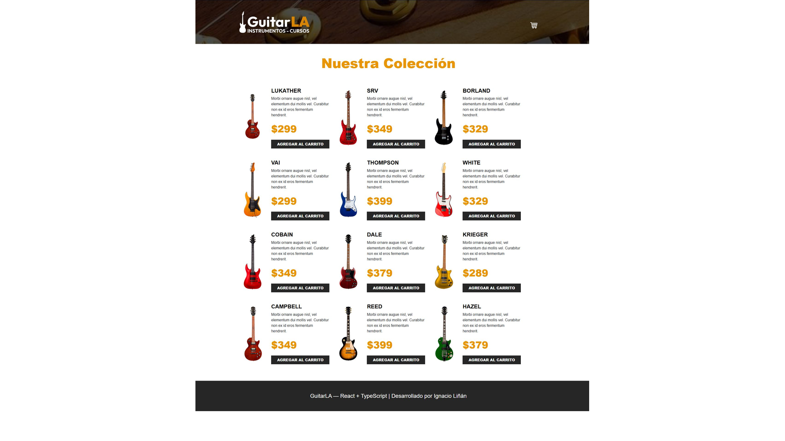

# 🎸 GuitarLA — React + TypeScript



Aplicación web de tienda de guitarras desarrollada con **React, TypeScript y Vite**.

Incluye un catálogo interactivo de guitarras y un carrito de compra con gestión de productos, cantidades y cálculo automático del total.

## Funcionalidades

- Catálogo de guitarras.
- Añadir productos al carrito.
- Aumentar y reducir cantidades.
- Eliminar productos.
- Vaciar el carrito.
- Cálculo automático del total.
- Gestión de estado con React y `useReducer`.
- Componentes tipados con TypeScript.
- Diseño responsive.

## Tecnologías

- React
- TypeScript
- Vite
- useReducer
- HTML5
- CSS3
- Bootstrap

## Ejecutar el proyecto

```bash
npm install
npm run dev
