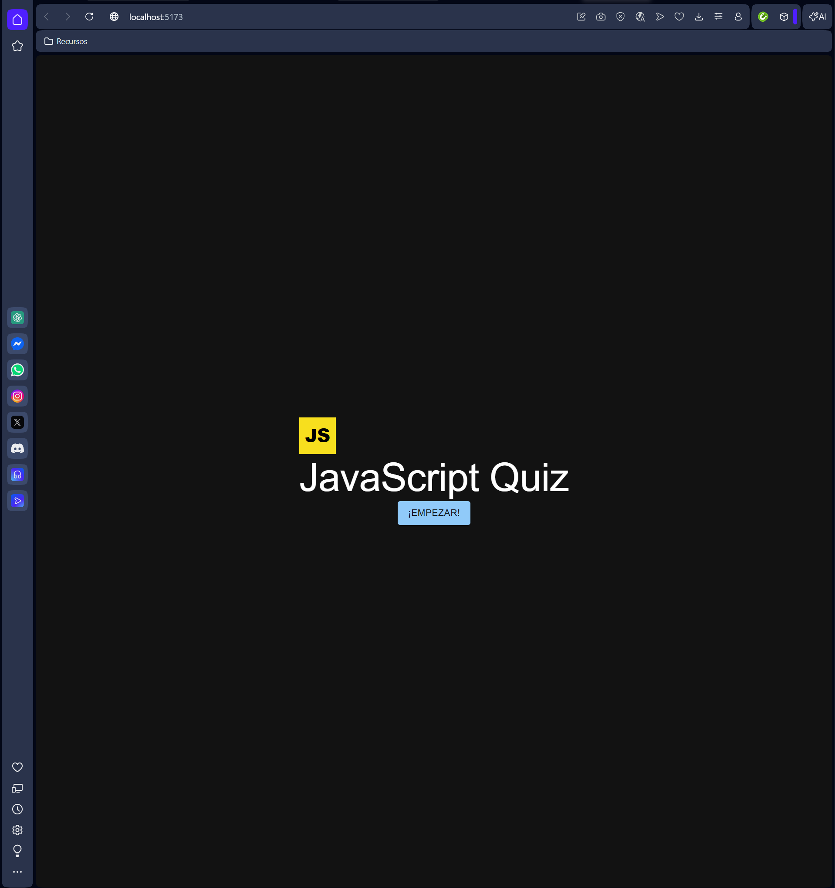
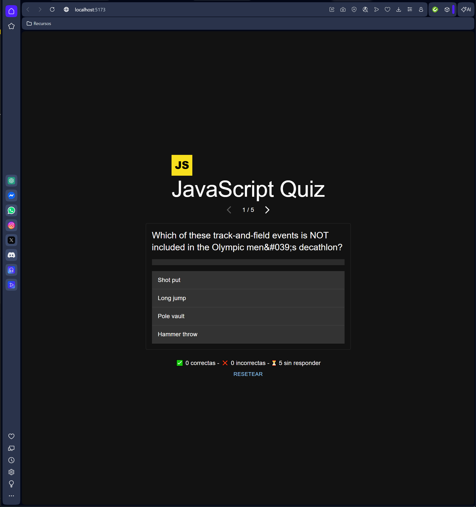
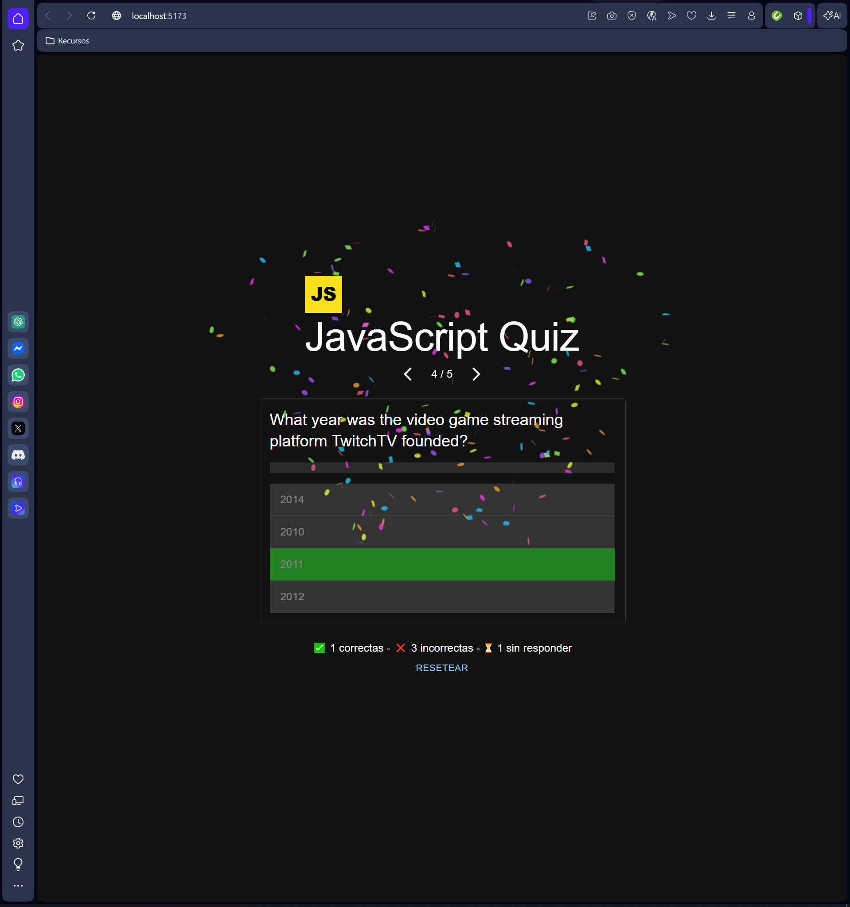

# 🟨 JavaScript Quiz

Proyecto sencillo desarrollado con **React + Vite + TypeScript**.

Aplicación tipo quiz que consume preguntas desde una API y permite responderlas, navegar entre ellas y ver el resultado final.

---

## 🚀 Tecnologías utilizadas

- React  
- Vite  
- TypeScript  
- Zustand (gestión de estado global)  
- Zustand Persist (persistencia en localStorage)  
- MUI (Material UI para la interfaz)  
- canvas-confetti (efecto visual al acertar)  

---

## 🧠 Funcionalidades

- Carga dinámica de preguntas  
- Navegación entre preguntas (paginación)  
- Indicador de progreso (ej: 3 / 5)  
- Respuestas correctas en verde  
- Respuestas incorrectas en rojo  
- Confetti al acertar  
- Footer con conteo de:
  - Correctas  
  - Incorrectas  
  - Sin responder  
- Botón de reseteo  
- Persistencia automática en localStorage  

---

## 🪝 Custom Hook

Se ha creado un hook personalizado llamado `useQuestionsData` para separar la lógica de cálculo de:

- Respuestas correctas  
- Incorrectas  
- Sin responder  

Utilizado en el componente `Footer`.

---

## 💾 Persistencia

Se utiliza `persist` de Zustand para guardar el estado en `localStorage`, permitiendo mantener el progreso incluso al recargar la página.

---

## 📸 Capturas

### 🏠 Pantalla principal

### ❓ Quiz en ejecución

### 🎉 Resultado con respuesta correcta

---

Proyecto académico para Desarrollo Web en Entorno Cliente (DAW).  
Desarrollado por Nacho.
