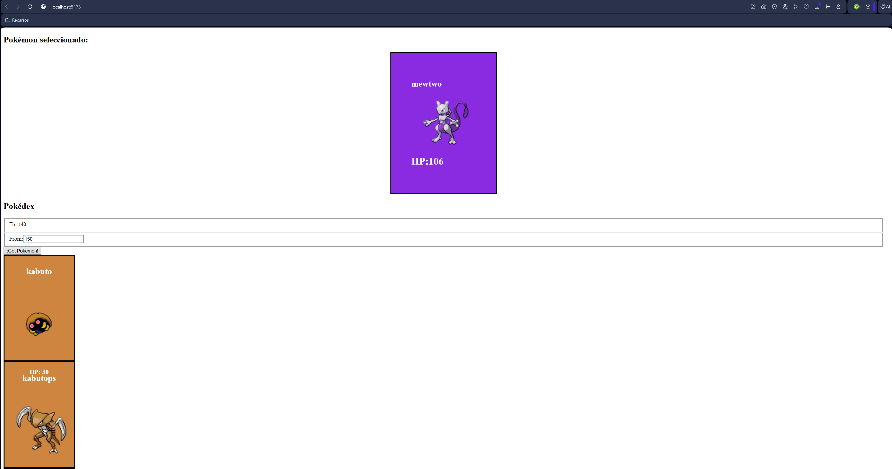

# 🧩 Pokédex en React + Vite

Este proyecto es una **Pokédex desarrollada con React y Vite**, cuyo objetivo es mostrar información de distintos Pokémon consumiendo datos desde la **PokéAPI**.

Es una evolución de una Pokédex anterior realizada únicamente con **HTML, CSS y JavaScript**, incorporando ahora conceptos propios de **React**, como componentes, estado (`useState`), efectos (`useEffect`) y paso de props.

👉 Pokédex anterior (HTML, CSS y JS):
https://github.com/NachoSLKN/Desarrollo-Web/tree/main/Frontend/Lenguajes%20de%20Marcas/Pokédex

---

## 🚀 Tecnologías utilizadas

- **React**
- **Vite**
- **JavaScript (ES6+)**
- **CSS**
- **PokéAPI**  
  https://pokeapi.co/

---

## 📦 Funcionalidades

- Listado dinámico de Pokémon
- Carga de datos desde una API externa
- Renderizado mediante componentes React
- Selección de un Pokémon para ver su información
- Uso de hooks:
  - `useState`
  - `useEffect`
- Estructura de proyecto modular y escalable

---

## 🧠 Diferencias respecto a la Pokédex anterior

| Pokédex HTML/CSS/JS | Pokédex React |
|--------------------|---------------|
| DOM manual         | Componentes React |
| Variables globales | Estado con hooks |
| Eventos directos   | Props y callbacks |
| Estructura simple  | Arquitectura por componentes |

Esta versión permite un **código más organizado**, reutilizable y fácil de mantener.

