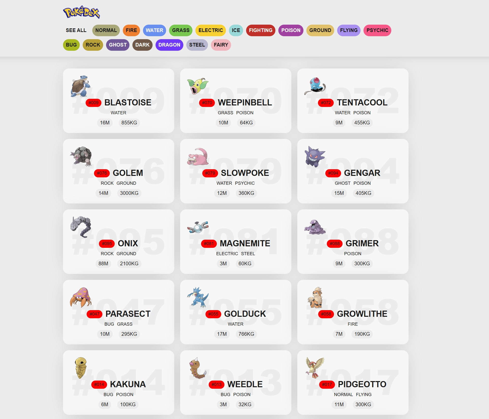

# 📘 Pokédex — Proyecto de Lenguajes de Marcas

Este es un **miniproyecto desarrollado con HTML, CSS y JavaScript**, cuyo objetivo es practicar la maquetación web y el consumo básico de datos simulados para mostrar información de Pokémon.

---

## 🖼️ Vista previa

---

## 🛠️ Tecnologías utilizadas

- **HTML5** — Estructura de la página  
- **CSS3** — Estilos y maquetación  
- **JavaScript** — Comportamiento básico de la interfaz  
- **Diseño modular** con carpetas para *css*, *img*, *js* y *screenshots*

---

## 📁 Estructura del proyecto

